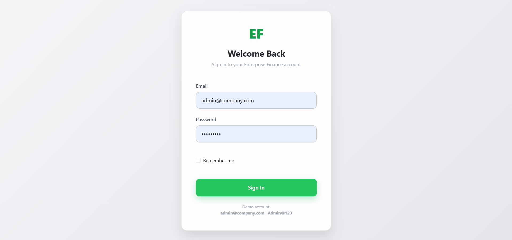
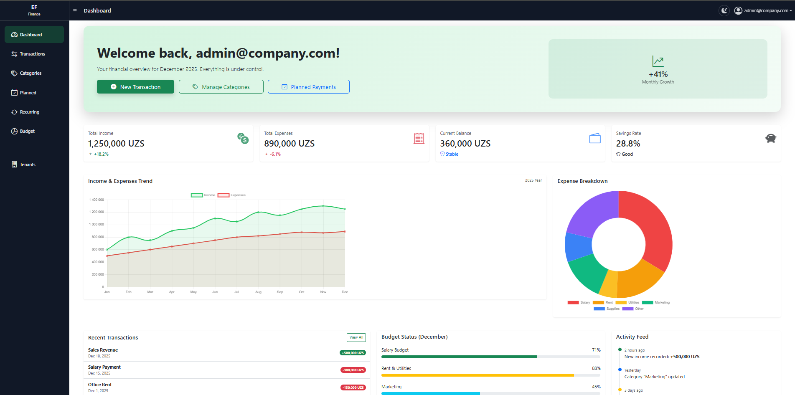
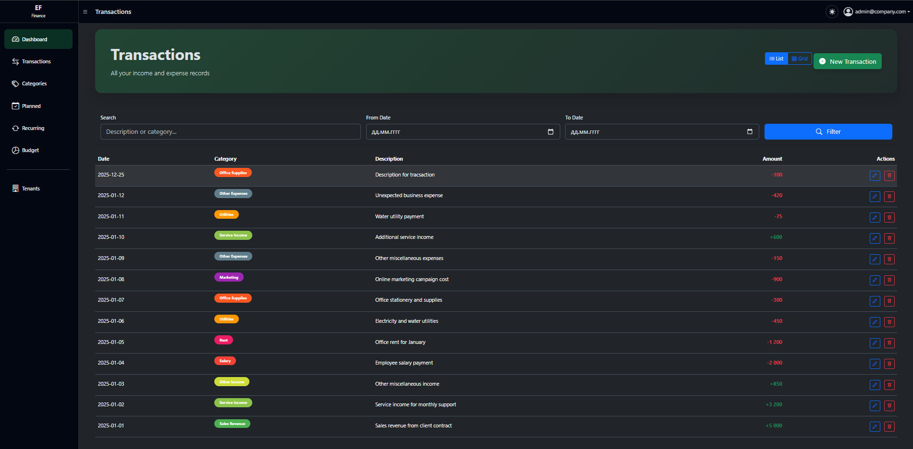
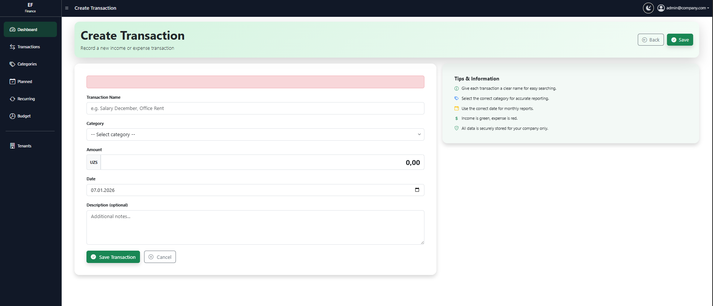
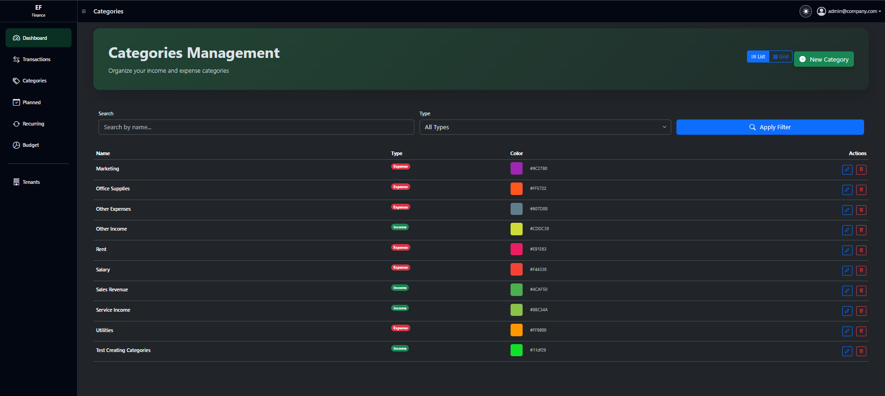
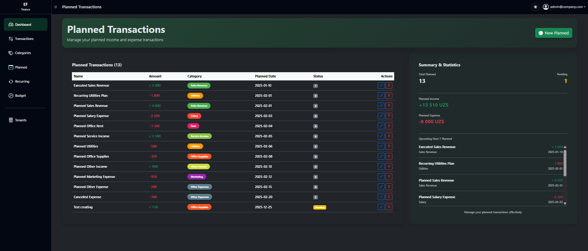
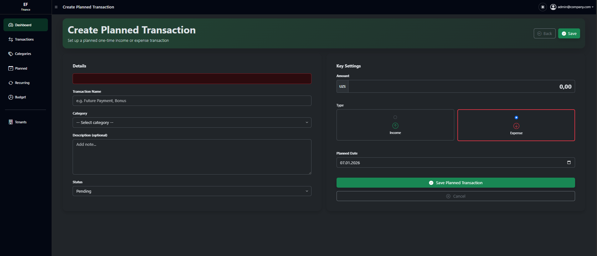
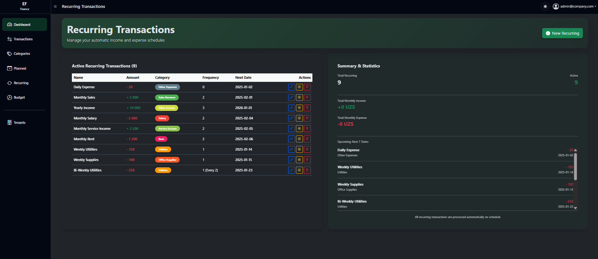
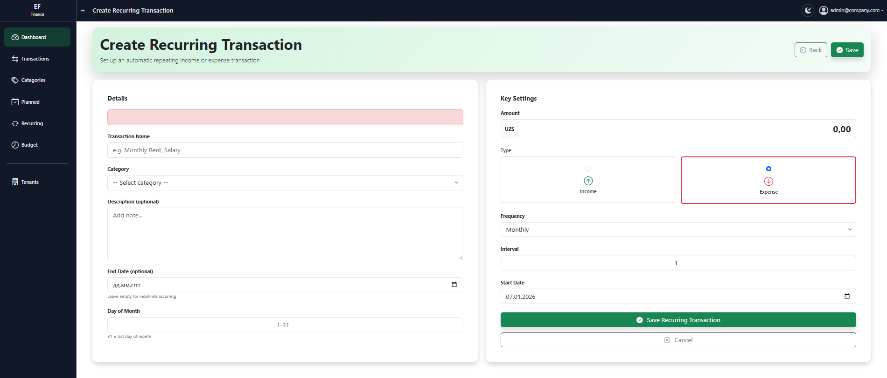
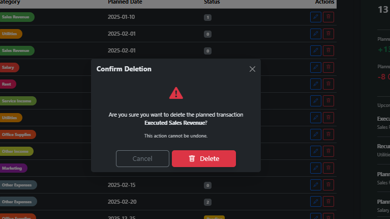

# 💼 EnterpriseFinance – Enterprise Expense Management System

## 📌 Overview

**EnterpriseFinance** is a web-based internal business application designed to manage, track, and control company expenses in a structured and transparent manner.

The system is built using **ASP.NET Core MVC** and **ASP.NET Core Identity**, focusing on real-world enterprise needs such as security, role-based access, and clear financial workflows.
This project intentionally avoids over-engineering and complex architectural patterns, prioritizing clarity, maintainability, and business value.

---

## 🎯 Key Features

* Company expense tracking and management
* Planned and recurring financial transactions
* Category-based expense classification
* Secure authentication using ASP.NET Core Identity
* Role-based authorization
* User-friendly UI with validation and confirmations
* Designed for internal enterprise usage

---

## 🧩 Technology Stack

### 🔹 Backend & Web

* ASP.NET Core MVC
* ASP.NET Core Identity
* Entity Framework Core
* SQL Server
* Razor Views

### 🔹 Security

* Identity-based authentication
* Role-based authorization
* Protected controllers and actions
* Secure handling of financial data

---

## 🔐 Authentication & Authorization

The application uses **ASP.NET Core Identity** to provide:

* Secure user login and authentication
* Role-based access control (e.g. Admin, Accountant, Manager)
* Protection of sensitive financial operations
* Centralized user and role management

---

## 💰 Expense Management Workflow

EnterpriseFinance allows organizations to:

* Register and manage company expenses
* Categorize expenses for better reporting
* Create planned transactions for future costs
* Configure recurring transactions for periodic expenses
* Prevent accidental data loss with confirmation dialogs
* Control access to financial data using roles

---

## 📁 Project Structure

```
EnterpriseFinance/
│
├── Controllers/
├── Models/
├── Views/
│   ├── Expenses/
│   ├── Categories/
│   ├── PlannedTransactions/
│   ├── RecurringTransactions/
│
├── Data/
│   └── ApplicationDbContext.cs
│
├── wwwroot/
│
├── screenshots/
│   └── *.png
│
└── README.md
```

---

## 🖼 Screenshots & Feature Walkthrough

Below are real screenshots from the application demonstrating core functionality and real business workflows.
All images are stored inside the **`screenshots/`** directory.

---

### 1️⃣ Authentication – Login Page

**File:** `screenshots/login.png`



* Secure login using ASP.NET Core Identity
* Entry point for all system users
* Role-based authentication foundation

---

### 2️⃣ Dashboard – System Overview

**File:** `screenshots/dashboard.png`



* Central overview of the expense management system
* Quick navigation to main modules
* Role-based visibility of information

---

### 3️⃣ Expense List

**File:** `screenshots/expenses_list.png`



* Displays all recorded expenses
* Structured and readable expense history
* Access controlled by user roles

---

### 4️⃣ Create Expense

**File:** `screenshots/create_expense.png`



* Form for adding new expenses
* Category selection and validation
* Server-side and client-side validation

---

### 5️⃣ Expense Categories Management

**File:** `screenshots/categories.png`



* Manage expense categories
* Standardized expense classification
* Restricted access for authorized roles

---

### 6️⃣ Planned Transactions

**File:** `screenshots/planned_transactions.png`



* Manage future planned expenses
* Helps forecast upcoming company costs
* Improves financial planning

---

### 7️⃣ Create Planned Transaction

**File:** `screenshots/create_planned_transaction.png`



* Add new planned expense entries
* Schedule future financial operations
* Role-based access control applied

---

### 8️⃣ Recurring Transactions

**File:** `screenshots/recurring_transactions.png`



* Manage recurring expenses (monthly, yearly, etc.)
* Automates repetitive financial records
* Reduces manual work

---

### 9️⃣ Create Recurring Transaction

**File:** `screenshots/create_recurring_transaction.png`



* Define recurring expense rules
* Configure frequency and parameters
* Designed for long-term financial tracking

---

### 🔟 Delete Confirmation Modal

**File:** `screenshots/delete_modal.png`



* Confirmation dialog before delete operations
* Prevents accidental data loss
* Improves system safety and user experience

---

## 🚀 Getting Started

### Prerequisites

* .NET SDK 7+
* SQL Server
* Visual Studio or VS Code

### Setup Steps

```bash
# Clone repository
git clone <repository-url>

# Update connection string in appsettings.json

# Apply database migrations
dotnet ef database update

# Run the application
dotnet run
```

---

## 🧠 Why This Project Matters

This project demonstrates:

* Practical ASP.NET Core MVC development
* Real usage of ASP.NET Core Identity
* Business-oriented thinking
* Secure handling of enterprise financial data
* Clean, understandable, and maintainable code

Suitable as:

* A **portfolio project**
* A **real internal enterprise module**
* A **reference ASP.NET Core MVC + Identity implementation**

---

## 👨‍💻 Author

**Bek (Kattabek Ahmadov)**
Full Stack .NET Software Engineer

---

## 📜 License

This project is intended for educational and demonstration purposes.

---

⭐ If you find this project useful, feel free to star the repository!
